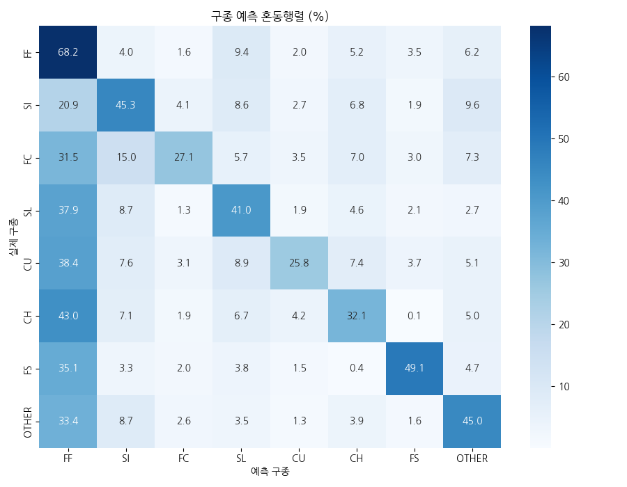
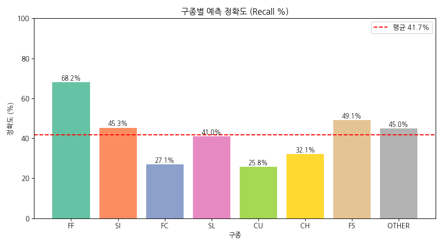

# ⚾ PitchIQ — MLB 실시간 투구 분석 & 다음 구종 예측

> 이전 투구 패턴과 경기 상황을 분석해 투수가 **다음에 던질 구종**을 예측하고,
> 실제 중계 영상과 연동해 투구 타이밍까지 자동으로 감지하는 서비스입니다.

---

## 📌 Project Overview

기존 중계 화면은 투수가 공을 던진 **이후**에야 구종·구속을 보여줍니다.
PitchIQ는 여기서 한발 더 나가 "다음엔 어떤 공을 던질까?"를 AI가 미리 예측해서 보여주는 것을 목표로 합니다.

MLB Statcast 데이터로 학습한 BiLSTM 모델이 다음 구종을 예측하고, YOLOv8 + 모션 감지로
실제 중계 영상에서 투구 타이밍을 자동으로 찾아내 두 파이프라인을 하나의 Streamlit 서비스로 묶었습니다.

## 🎯 Features

- MLB Statcast 2025 시즌 전체 데이터 기반 학습
- BiLSTM + 투수/타자 Embedding + 경기 상황(카운트·주자·점수차 등) 기반 다음 구종 예측
- 투수 성향 피처(구종별 비율, 카운트별 최빈 구종, 상대 타자 전적) 반영
- YOLOv8 커스텀 모델로 실제 중계 영상에서 야구공 탐지 및 궤적 추적
- 프레임 차이 기반 모션 감지로 투구 타이밍 자동 인식 (`pose_detector.py` — Phase 2에서 포즈 추정을 시도했다가 정확도/속도 문제로 모션 감지로 전환한 결과물입니다. 자세한 배경은 블로그 Day 3 참고)
- OCR(pytesseract)로 중계 화면의 구속/구종 텍스트 자동 인식 시도
- YouTube 영상 자동 다운로드 및 캐싱 (yt-dlp)
- 실제 경기 선택 → 백그라운드 스레드로 실시간 스캔 → 다이아몬드/카운트 시각화까지 이어지는 Streamlit 대시보드

## 🏗 Architecture

```
                     ┌─ MLB Statcast (pybaseball) ─┐
                     │                              │
                     ▼                              ▼
            Feature Engineering              중계 영상 (YouTube / 로컬)
         (시퀀스 5구 + 상황 + 성향)                    │
                     │                              ▼
                     ▼                    YOLOv8 공 탐지 + 모션 감지
              BiLSTM 학습/추론                  (투구 타이밍 자동 인식)
                     │                              │
                     └──────────────┬───────────────┘
                                    ▼
                       PitchPipeline (src/pipeline.py)
                        구종 예측 + 확률 + 경기 상황
                                    │
                                    ▼
                         Streamlit 실시간 대시보드
                    (영상 동기화 · 다이아몬드 뷰 · 카운트 표시)
```

## 🛠 Tech Stack

| 분야 | 기술 | 비고 |
|---|---|---|
| Language | Python 3.13 | |
| 데이터 수집 | pybaseball (Statcast) | |
| 딥러닝 | TensorFlow 2.21 / Keras 3 | BiLSTM + Embedding |
| 객체 탐지 | YOLOv8 (Ultralytics) | 야구공 커스텀 학습 |
| 영상 처리 | OpenCV, yt-dlp | YouTube 다운로드 + 프레임 처리 |
| OCR | pytesseract | 시스템 tesseract 필요 |
| 시각화 | Matplotlib, Seaborn, Plotly | |
| 서비스 | Streamlit | 백그라운드 스레드 기반 실시간 스캔 |
| 모델 파일 관리 | Git LFS | `models/*.h5`, `*.pt` |

## 📈 Model Performance

| Model | Accuracy | Macro F1 |
|---|---|---|
| Random Guess (8-class) | 12.5% | - |
| Initial LSTM | 39% | - |
| BiLSTM (Embedding + 투수 성향 피처, seq_len=5) | 46.14% | 39.2% |
| **BiLSTM (Embedding + 투수 성향 피처, seq_len=3) — 현재 모델** | **48.5%** | **43.4%** |

Day 2에서 시퀀스 길이(3/5/8)와 클래스 불균형 보정(class weight) 실험을 진행했고, `seq_len=3`이
가장 안정적으로 좋은 결과를 보여 기본값으로 채택했습니다. 실험 과정과 트레이드오프는
[`docs/blog/day2.md`](docs/blog/day2.md)에 정리했습니다.

혼동행렬·클래스별 정확도는 `python src/evaluate.py` 실행 후 `notebooks/figures/`에서 확인할 수 있습니다.

<p align="center">
  
  
</p>

## 📂 Project Structure

```
baseball-pitch-predictor/
├── data/
│   ├── raw/            # Statcast CSV (gitignore — 직접 수집 필요)
│   └── yolo/            # YOLO 학습용 데이터셋
├── models/
│   ├── pitch_predictor.h5   # BiLSTM 모델 (Git LFS)
│   ├── scaler.pkl            # 피처 스케일러 (Git LFS)
│   └── baseball_detector.pt  # YOLO 커스텀 모델 (Git LFS)
├── notebooks/
│   ├── eda.py
│   └── figures/
├── src/
│   ├── data_collector.py       # Statcast 수집
│   ├── feature_engineering.py  # 시퀀스/컨텍스트/성향 피처 생성
│   ├── model.py                 # BiLSTM 모델 정의 및 학습
│   ├── evaluate.py              # 성능 평가 + 시각화
│   ├── train_yolo.py            # YOLO 커스텀 모델 학습 (Roboflow)
│   ├── yolo_detector.py         # 야구공 탐지 + 궤적/구속 추정
│   ├── pose_detector.py         # 투구 타이밍 감지 (모션 기반) + OCR
│   └── pipeline.py              # YOLO 이벤트 → BiLSTM 예측 통합
├── streamlit_app/
│   └── app.py                    # 실시간 대시보드
├── docs/
│   ├── ROADMAP.md               # 5일 고도화 로드맵
│   └── blog/                     # Day별 기술 블로그 초안
├── requirements.txt
└── requirements-dev.txt
```

## 🚀 Getting Started

```bash
git clone https://github.com/jjssspark/DL_Pitcher.git
cd DL_Pitcher

# 대용량 모델 파일은 Git LFS로 관리됩니다
git lfs install
git lfs pull

python3.13 -m venv venv
source venv/bin/activate
pip install -r requirements.txt      # 서비스 실행용
# pip install -r requirements-dev.txt  # 노트북/모델 학습까지 필요하면

# 1) Statcast 데이터 수집 (최초 1회, 20~30분 소요)
python src/data_collector.py --full --year 2025

# 2) 모델 학습 (models/pitch_predictor.h5, scaler.pkl 생성)
python src/model.py

# 3) 서비스 실행
streamlit run streamlit_app/app.py
```

> OCR 기능을 쓰려면 `brew install tesseract`(macOS) 등으로 시스템 tesseract가 별도로 필요합니다.
> `src/train_yolo.py`로 YOLO 모델을 직접 학습하려면 Roboflow 계정과 API 키가 필요합니다.

## ⚙ Pipeline

```
Statcast Data → Preprocessing → Feature Engineering → BiLSTM Training
                                                              │
YouTube/로컬 영상 → YOLOv8 탐지 → 모션 기반 투구 타이밍 인식      │
                                                              ▼
                                              PitchPipeline (통합 예측)
                                                              │
                                                              ▼
                                                Streamlit 실시간 서비스
```

## 🚧 Known Limitations

- `pose_detector.py`는 이름과 달리 실제 포즈 추정 모델이 아니라 프레임 차이 기반 모션 감지로 동작합니다 (모듈명 정리는 추후 예정).
- OCR 기반 구속/구종 인식은 중계 화면 레이아웃에 따라 정확도 편차가 있습니다.
- YOLO 학습 스크립트의 `device="mps"`는 Apple Silicon 전용입니다. 다른 환경에서는 `cuda`/`cpu`로 수정이 필요합니다.

## 🗺 Roadmap

포트폴리오/서비스 완성까지의 5일 로드맵은 [`docs/ROADMAP.md`](docs/ROADMAP.md), Day별 기술 정리는 [`docs/blog/`](docs/blog/)에서 확인할 수 있습니다.

## 🚀 Future Work

- 실시간 경기 영상 분석 정확도 개선
- Pitch Tracking 자동화 고도화
- MLB → KBO 확장
- 선수 맞춤 분석
- 모바일 서비스 개발

## 👨‍💻 Developer

**박지수** — AI Deep Learning Project, 2026
